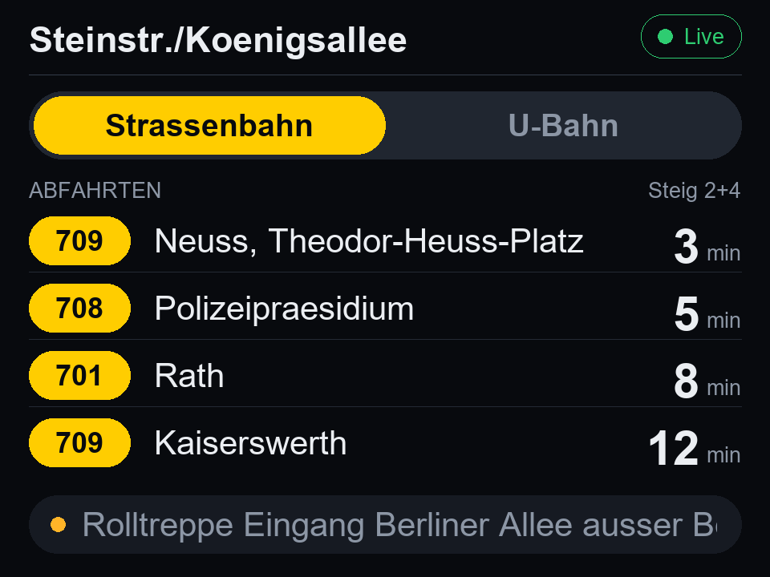
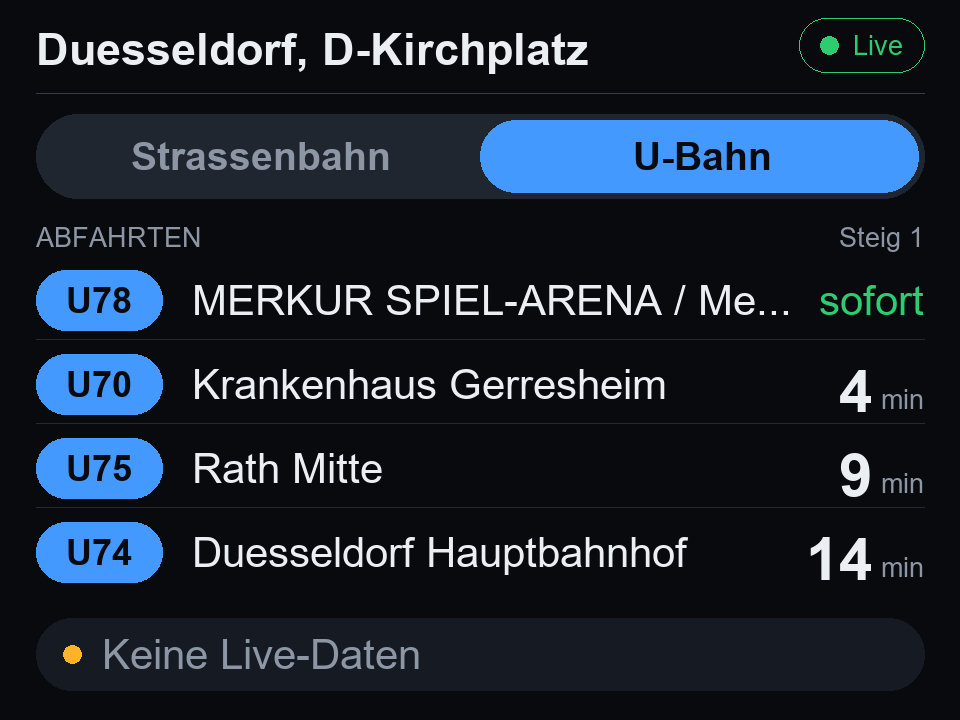

# Screenshots

Real device photos aren't in the repository yet (if you have one, contributions
welcome — see the note at the bottom). In the meantime, the images below are
rendered mockups: a to-scale reproduction of the exact colors, pixel positions,
fonts, and text-truncation logic from the drawing functions in
[src/main.cpp](../src/main.cpp), filled in with representative sample data. They
are not a live capture of the firmware running, but they accurately reflect what
it draws.

## Strassenbahn Tab

## U-Bahn Tab

Note how the header shows a different stop name in each tab — Straßenbahn and
U-Bahn each have their own independently configured Haltestelle (see
[GETTING_STARTED.md](./GETTING_STARTED.md)).

## Status Chip States

The chip in the top-right corner sizes itself to its content and reflects data
freshness:

- **Green `Live`** — data was fetched within the last minute; the dot pulses.
- **Amber `vor X Min`** — the last successful update is X minutes old. The
  countdowns keep ticking down locally in the meantime, and departed trains
  drop off the list on their own.

An imminent departure shows a green `sofort` instead of a minute count (visible
in the U-Bahn screenshot above).

## Interaction

- Touch the top tab area to switch between tram and U-Bahn
- Touch the departure list area to toggle direction

## Replacing These With Real Photos

If you have a working device, a straight-on photo of the screen (or a close-up of
the touch interaction areas) is a welcome addition — just drop it in
`docs/screenshots/` and update the references above.
